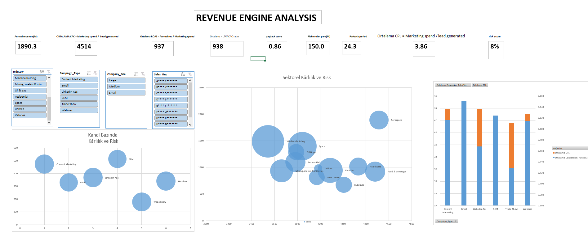

# Revenue-Engine-Perfomance-Analysis
Data-driven growth and risk optimization analysis using System Theory framework
Revenue Engine: Data-Driven Performance Analysis

Bu çalışma Marketing veri setinin toplamda sahip olduğu 13.4M$’lık geliri. Sistem analizi perspektifiyle incelenmiştir. Amaç gelirin verimliliğini, gelirin yapısı, geliri oluşturan alt kırılımlardaki, scale(Büyütme) veya optimize(iyileştirme) fırsatlarını tespit ederek, geliri arttırmak için stratejik aksiyonlar oluşturulmuştur. Metrik incelerken kullanılan sistemsel tasarım aşağıdaki tablodadır.

### 🧠 Analitik Çerçeve (Framework)

| Değişken | Tanım | Sistem İşleyişi (Basit Açıklama) |
| :--- | :--- | :--- |
| **Gelir Kaynağı** | Marketing Spend & Lead Sayısı | Sistemin ana yakıtı ve büyüme potansiyeli. |
| **Gelir Verimi** | CLTV / CAC | Yatırımın kaç kat değer ürettiği (Çarpan Etkisi). |
| **Sistem Sağlığı** | Ödeme Disiplini | Nakit akış kalitesi ve sistemsel tahsilat başarısı. |
| **Elde Etme Hızı** | Payback Period (Gün) | Yatırımın kasaya geri dönme ivmesi. |
| **Kaldıraç / Strateji**| Scale / Optimizasyon | Verim/Hız hedefin üstündeyse **Scale**, altındaysa **Optimize**. |
| **Sızıntı Tespiti** | Risk Score & Riskteki Para | Churn ve ödeme gecikmesi kaynaklı enerji kaybı. |

Geliri yukarıdaki tabloya uygun bir şekilde akış olarak ele aldım. Bu tabloya göre gelirin sağlığını ölçtüm

| Metric | Value |
| :--- | :--- |
| **Total Revenue** | $13,452.50M |
| **Average ROAS** | 736 |
| **LTV/CAC Ratio** | 737 |
| **Average CAC** | $4,021 |
| **Average CPL** | $4.02 |
| **Revenue at Risk** | $2,203.60M |
| **Payback Period** | 194 Days |
| **Payment Discipline** | 0.87 |

Risk altında gözüken $2203.60M’luk gelirin alt kırılımlarda
Genel toplamda üretilen gelirin verimli olduğu gözükmektedir(LTV/CAC ratio). Problem ise gelirin 0.87’lik bir ödeme disiplini ile çalışması ve gelirin 194 gün sonra edilmesi fren mekanizması işlevi görmektedir. Veriler göz önünde bulundurulduğuna tahsilat hızının büyümenin önünde engel olduğunu göstermektedir. Toplam gelirin %16.3($2.2b)’lik kısmı risk altında olması burada bir potansiyel olduğunu göstermektedir. Alt kırılımları optimize veya scale etme yöntemleriyle burada oluşturulacak potansiyel, riski azaltarak gelir arttırımına gidecek potansiyel olabilir

Örnek
Bu aşamada Genel değerleri, aşama aşama alt kırılımlarla parçalayarak, gelir nezdinde stratejik potansiyel incelemesi yaptım. Genel verilerdeki, payback score, gelir riski, ve LTV/CAC oluşan hanttallığı, odak noktasını en dibe çekince fırsat yaratılabilecek alanlar aşağıdadır.

| Katman | Gelir (Revenue) | Verimlilik (LTV/CAC) | Hız (Payback) | Risk (Rev at risk) |
| :--- | :--- | :--- | :--- | :--- |
| **1. Şirket Geneli** | $13,452.5M | 737 | 194 Gün | 16.3% |
| **2. Medium (Size)** | $4,748.5M | 1077 | 52 Gün | 31% |
| **3. Buildings (Ind.)** | $473.4M | 1023 | 5.9 Gün | 8% |
| **4. Email (Kanal)** | **$73.7M** | **1237** | **0.9 Gün** | **0%** |

Sonuç
Yukarıdaki tablo nezdinde; şirket genelinde yer alan 194 günlük payback score, gelirin doğru kırılımlarla incelenmesi sonucunda 1 güne düştüğü gözükmektedir. Burada yapılacak maliyet kaydırımı veya maliyet arttırımı ile bu segmentte fırsat olduğu gözükmektedir.
Risk score, Gelir, Payback gibi metriklerin sonucunda Email kanalının üst segmentlere göre daha az olduğu görülmektedir.Bu da optimize edilebilir. Aşamalı olarak %10 yatırım arttırımı ile email kanalı gözlemlenmelidir. Durma noktamız ise üst segmentteki CLTV/CAC ratio ve payback score baz alınmalıdır
